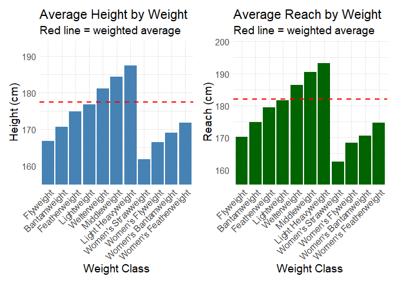
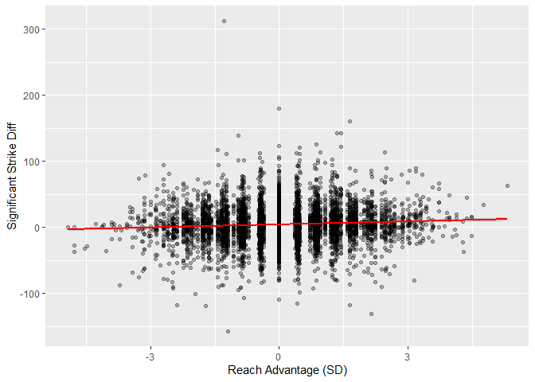
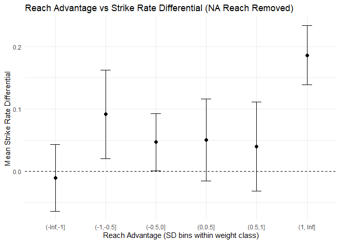
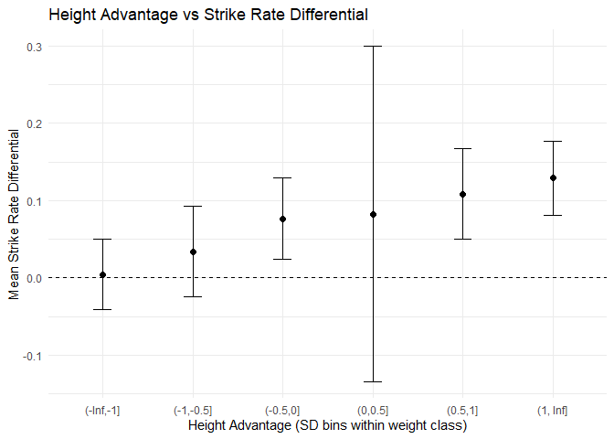
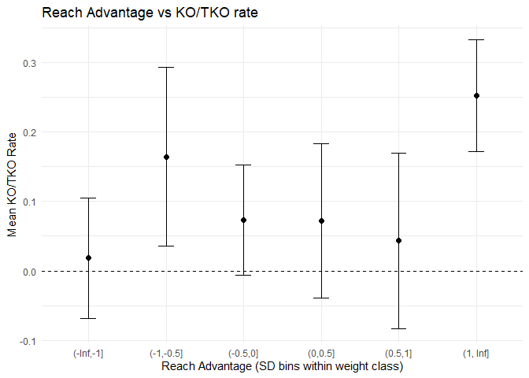
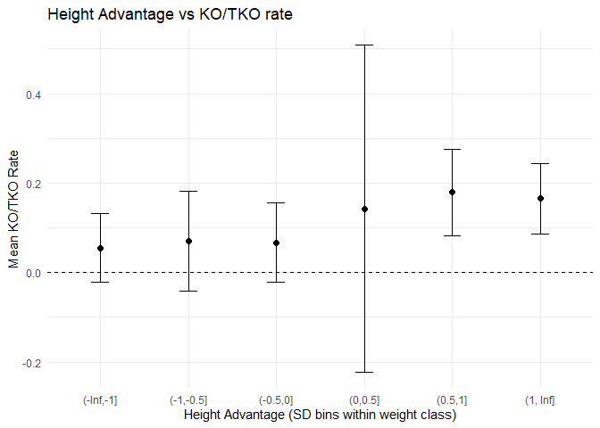
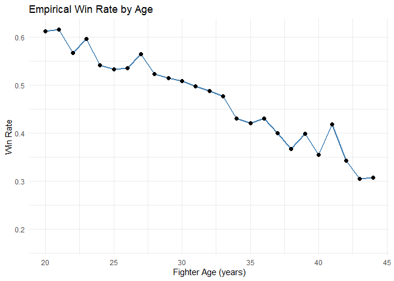
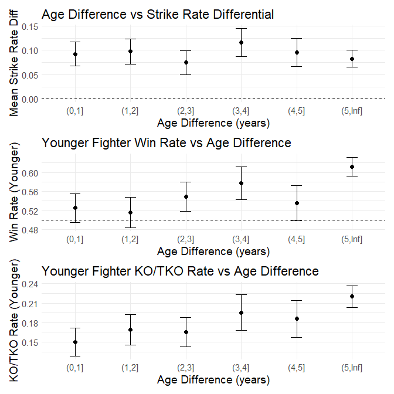
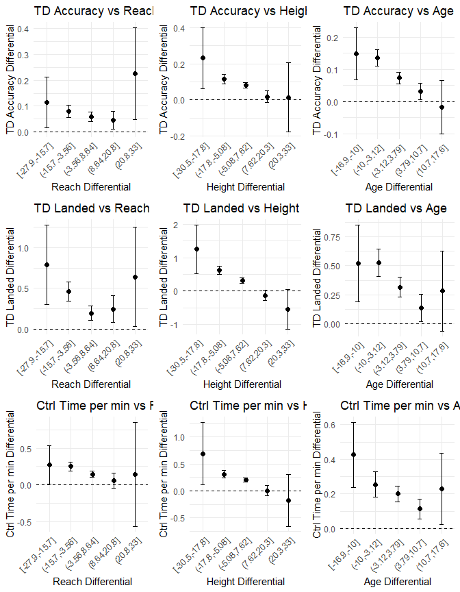

Final Project Report
================
Henry Tang
2025-11-30

## Introduction

This project seeks to find patterns within MMA fighter attributes and
fight performance outcomes The goal is to find objective empirical
patterns between physical traits and performance, questions such as how
reach or age or height affects striking differential or career knockdown
rate are of interest. Mere win rates or any similar fight summarizing
outcomes are not the goal of this project, as that scope lends too broad
and uninformative. The goal is not only to determine the result of
fights based on traits, but inform how traits affect the way in which
fights unfold. I’ll first describe the data, then explore various
correlations, and further validateand test more convincing patterns, in
case they are collinear or mostly explained by another variable.

## Data

The dataset comes from the kaggle dataset
<https://www.kaggle.com/datasets/remypereira/mma-dataset-2023-ufc>
containing data about fighters, fights, and events up through 2023.

The goal is to find relations between fighter attributes and performance
results, but different attributes are taken into consideration
differently. Weight for instance ins factored into the organization of a
fight, so it will be constant between fighters in the same fight, and
thus less informative on the specific between-fighter interaction that
takes place in an mma fight. Here are the relevant variables from the
dataset:

``` r
dfs <- list(
  fighters   = read_csv("dataset/ufc_fighter_data.csv"),
  fight_stat = read_csv("dataset/ufc_fight_stat_data.csv"),
  events     = read_csv("dataset/ufc_event_data.csv"),
  fight_data = read_csv("dataset/ufc_fight_data.csv")
)

# create schema for each table
schemas <- map(dfs, ~ tibble(
  variable = names(.x),
  type = sapply(.x, function(z) paste(class(z), collapse=","))
))

schemas$fighters
```

    ## # A tibble: 14 × 2
    ##    variable           type     
    ##    <chr>              <chr>    
    ##  1 fighter_id         numeric  
    ##  2 fighter_f_name     character
    ##  3 fighter_l_name     character
    ##  4 fighter_nickname   character
    ##  5 fighter_height_cm  numeric  
    ##  6 fighter_weight_lbs numeric  
    ##  7 fighter_reach_cm   numeric  
    ##  8 fighter_stance     character
    ##  9 fighter_dob        Date     
    ## 10 fighter_w          numeric  
    ## 11 fighter_l          numeric  
    ## 12 fighter_d          numeric  
    ## 13 fighter_nc_dq      numeric  
    ## 14 fighter_url        character

fighter_id (numeric): Primary key. Join key to fight_stat and fight_data

fighter_f_name / fighter_l_name / fighter_nickname (character):
Identification only

fighter_height_cm (numeric): Independent variable, height in centimeters

fighter_weight_lbs (numeric): Controlled variable, secondary to
fight_stat weight since only accounts for recent weight but not weight
for specific event, blind to weight class changes, in lbs

fighter_reach_cm (numeric): Independent variable, reach or wingspan in
centimeters

fighter_dob (Date): Fighter date of birth will be used to compute the
age of the fighter and the age differential

``` r
schemas$fight_stat
```

    ## # A tibble: 14 × 2
    ##    variable           type     
    ##    <chr>              <chr>    
    ##  1 fight_stat_id      numeric  
    ##  2 fight_id           numeric  
    ##  3 fighter_id         numeric  
    ##  4 knockdowns         numeric  
    ##  5 total_strikes_att  numeric  
    ##  6 total_strikes_succ numeric  
    ##  7 sig_strikes_att    numeric  
    ##  8 sig_strikes_succ   numeric  
    ##  9 takedown_att       numeric  
    ## 10 takedown_succ      numeric  
    ## 11 submission_att     numeric  
    ## 12 reversals          numeric  
    ## 13 ctrl_time          character
    ## 14 fight_url          character

fight_id (numeric): Primary key. Join key to fight_data.

fighter_id (numeric): Join to fighters.

knockdowns (numeric): Uncommon, high-leverage outcome; useful predictor
for finish or at least finishing ability

total_strikes_att / total_strikes_succ (numeric): Volume and accuracy;
proxies for pace and efficiency.

sig_strikes_att / sig_strikes_succ (numeric): Higher-quality striking;
better proxy of actual fight advantage.

takedown_att / takedown_succ (numeric): Grappling offense; sensitive to
matchup asymmetries.

submission_att (numeric): Offensive grappling threat; noisy but
sometimes predictive of finish likelihood.

reversals (numeric): Reverses of grappling position dominance; probably
not super important

ctrl_time (character): Convert to seconds; positional dominance;
predictor of decision outcomes.

``` r
schemas$events
```

    ## # A tibble: 7 × 2
    ##   variable      type     
    ##   <chr>         <chr>    
    ## 1 event_id      numeric  
    ## 2 event_name    character
    ## 3 event_date    Date     
    ## 4 event_city    character
    ## 5 event_state   character
    ## 6 event_country character
    ## 7 event_url     character

event_id (numeric): Join key.

event_date (Date): For computing age at fight.

``` r
schemas$fight_data
```

    ## # A tibble: 15 × 2
    ##    variable       type        
    ##    <chr>          <chr>       
    ##  1 fight_id       numeric     
    ##  2 event_id       numeric     
    ##  3 referee        character   
    ##  4 f_1            numeric     
    ##  5 f_2            numeric     
    ##  6 winner         numeric     
    ##  7 num_rounds     character   
    ##  8 title_fight    logical     
    ##  9 weight_class   character   
    ## 10 gender         character   
    ## 11 result         character   
    ## 12 result_details character   
    ## 13 finish_round   numeric     
    ## 14 finish_time    hms,difftime
    ## 15 fight_url      character

fight_id (numeric): Primary key; join to fight_stat.

event_id (numeric): Join to events.

f_1 / f_2 (numeric): Fighter IDs for competitor A/B.

winner (numeric): Usually 1, 2, or 0 (draw/NC).

title_fight (logical): Possible control for skill level, but unlikely

weight_class (character): Control for weightclass.

gender (character): Control for gender

result (character): DEC/KO/SUB.

finish_round (numeric): Round of stoppage.

finish_time (hms): Time within round; combine with finish_round for
total elapsed time.

## Data Exploration

For each type of physical variable - group by weight class and gender -
find mean and deviation - compare and overlay with other weightclasses -
compare with disparity instead - find associations with performance
metrics

``` r
fight_stat <- dfs$fight_stat
fighters   <- dfs$fighters
events     <- dfs$events
fight_data <- dfs$fight_data

# Helper: ctrl_time to seconds
ctrl_to_sec <- function(x) {
  ifelse(is.na(x) | x == "--", NA_real_, period_to_seconds(ms(x)))
}
fight_stat <- fight_stat %>% mutate(ctrl_sec = ctrl_to_sec(ctrl_time))

# Desired weight class order
weight_class_order <- c(
  "Flyweight", "Bantamweight", "Featherweight", "Lightweight", 
  "Welterweight", "Middleweight", "Light Heavyweight",
  "Women's Strawweight", "Women's Flyweight", "Women's Bantamweight", "Women's Featherweight"
)

# Filter out Catch Weight and Open Weight
fight_data_filtered <- fight_data %>%
  filter(!weight_class %in% c("Catch Weight", "Open Weight"))

# Average height/reach per weight class — fight-weighted
fight_long <- fight_data_filtered %>%
  pivot_longer(cols = c(f_1, f_2), names_to = "pos", values_to = "fighter_id")

class_averages <- fight_long %>%
  left_join(fighters %>% select(fighter_id, height_cm = fighter_height_cm, reach_cm = fighter_reach_cm),
            by = "fighter_id") %>%
  group_by(weight_class) %>%
  summarize(
    avg_height_cm = mean(height_cm, na.rm = TRUE),
    avg_reach_cm  = mean(reach_cm,  na.rm = TRUE),
    n_fights = n() / 2,
    .groups = "drop"
  ) %>%
  filter(n_fights >= 20) %>%
  filter(weight_class %in% weight_class_order) %>%   # Drop anything not in our list
  mutate(weight_class = factor(weight_class, levels = weight_class_order))

# Overall weighted averages (used only for the red line)
overall_avg <- class_averages %>%
  summarize(
    overall_avg_height = weighted.mean(avg_height_cm, n_fights, na.rm = TRUE),
    overall_avg_reach  = weighted.mean(avg_reach_cm,  n_fights, na.rm = TRUE)
  )

# Better y-axis limits: based on the actual class averages (not all fighters)
height_min <- min(class_averages$avg_height_cm, na.rm = TRUE) - 5
height_max <- max(class_averages$avg_height_cm, na.rm = TRUE) + 5
reach_min  <- min(class_averages$avg_reach_cm,  na.rm = TRUE) - 5
reach_max  <- max(class_averages$avg_reach_cm,  na.rm = TRUE) + 5
```

``` r
# Plots
p_height <- ggplot(class_averages, aes(x = weight_class, y = avg_height_cm)) +
  geom_bar(stat = "identity", fill = "steelblue") +
  geom_hline(yintercept = overall_avg$overall_avg_height, lty = 2, color = "red", size = 1) +
  coord_cartesian(ylim = c(height_min, height_max)) +
  theme_minimal() +
  theme(axis.text.x = element_text(angle = 45, hjust = 1)) +
  labs(title = "Average Height by Weight",
       subtitle = "Red line = weighted average",
       x = "Weight Class", y = "Height (cm)")

p_reach <- ggplot(class_averages, aes(x = weight_class, y = avg_reach_cm)) +
  geom_bar(stat = "identity", fill = "darkgreen") +
  geom_hline(yintercept = overall_avg$overall_avg_reach, lty = 2, color = "red", size = 1) +
  coord_cartesian(ylim = c(reach_min, reach_max)) +
  theme_minimal() +
  theme(axis.text.x = element_text(angle = 45, hjust = 1)) +
  labs(title = "Average Reach by Weight",
       subtitle = "Red line = weighted average",
       x = "Weight Class", y = "Reach (cm)")

# Display side-by-side
p_height <- p_height + theme(text = element_text(size = 14))
p_reach  <- p_reach  + theme(text = element_text(size = 14))

# Combine side-by-side
combined_plot <- p_height + p_reach + plot_layout(ncol = 2, widths = c(1,1))

# Display
combined_plot
```

<!-- -->

Intuitively, heavier weights feature taller average heights and longer
reaches. The average weight of a fighter weighted on fighter activity is
a bit higher than just the middle of the weightclasses likely because
the UFC had a long history without divisions lighter than lightweight.

``` r
# Compute mean and SD per weight class for height and reach
class_stats <- fighters %>%
  inner_join(fight_long %>% select(fighter_id, weight_class), by = "fighter_id") %>%
  group_by(weight_class) %>%
  summarize(
    mean_reach = mean(fighter_reach_cm, na.rm = TRUE),
    sd_reach   = sd(fighter_reach_cm, na.rm = TRUE),
    mean_height = mean(fighter_height_cm, na.rm = TRUE),
    sd_height   = sd(fighter_height_cm, na.rm = TRUE),
    .groups = "drop"
  )

fight_disparities <- fight_data_filtered %>%
  select(fight_id, f_1, f_2, weight_class) %>%
  left_join(fighters %>% select(fighter_id, reach_cm = fighter_reach_cm), by = c("f_1" = "fighter_id")) %>%
  rename(reach_f1 = reach_cm) %>%
  left_join(fighters %>% select(fighter_id, reach_cm = fighter_reach_cm), by = c("f_2" = "fighter_id")) %>%
  rename(reach_f2 = reach_cm) %>%
  left_join(class_stats, by = "weight_class") %>%
  mutate(
    z_reach_f1 = (reach_f1 - mean_reach) / sd_reach,
    z_reach_f2 = (reach_f2 - mean_reach) / sd_reach,
    reach_advantage = z_reach_f1 - z_reach_f2
  ) %>%
  select(fight_id, weight_class, reach_advantage)

fight_outcomes <- fight_stat %>%
  left_join(fight_data_filtered %>% select(fight_id, f_1, f_2), by = "fight_id") %>%
  mutate(role = case_when(
    fighter_id == f_1 ~ "f1",
    fighter_id == f_2 ~ "f2",
    TRUE ~ NA_character_
  )) %>%
  filter(!is.na(role)) %>%
  select(fight_id, role, sig_strikes_succ, knockdowns, ctrl_sec) %>%
  pivot_wider(
    names_from = role,
    values_from = c(sig_strikes_succ, knockdowns, ctrl_sec)
  ) %>%
  left_join(fight_disparities, by = "fight_id") %>%
  mutate(
    strike_succ_diff = sig_strikes_succ_f1 - sig_strikes_succ_f2,
    knockdown_diff   = knockdowns_f1       - knockdowns_f2,
    ctrl_diff        = ctrl_sec_f1          - ctrl_sec_f2
  )


# Correlation
cor(fight_outcomes$reach_advantage, fight_outcomes$strike_succ_diff, use="complete.obs")
```

    ## [1] 0.07596565

``` r
# Scatter
ggplot(fight_outcomes, aes(x = reach_advantage, y = strike_succ_diff)) +
  geom_point(alpha=0.3) +
  geom_smooth(method="lm", color="red") +
  labs(x="Reach Advantage (SD)", y="Significant Strike Diff")
```

<!-- -->

Rather weak trend on a messy graph, so filtering for fights that spent
more time standing, fights that had more strikes exchanged (so fewer
short kos) and changing strike differential to a strike differential
rate could be more informative on what I’m looking for, how fights look
on the feet with a reach disparity.

``` r
fight_outcomes <- fight_outcomes %>%
  mutate(
    total_sig = sig_strikes_succ_f1 + sig_strikes_succ_f2,
    strike_rate_diff = strike_succ_diff / pmax(total_sig, 1)
  ) %>%
  mutate(total_ctrl = ctrl_sec_f1 + ctrl_sec_f2) %>%
  filter(total_ctrl < 60)

# Drop fights with missing reach advantage (systematically biased)
fight_outcomes_clean <- fight_outcomes %>%
  filter(!is.na(reach_advantage))

# Recompute reach bins (no NA bin)
reach_bins_clean <- fight_outcomes_clean %>%
  mutate(bin = cut(
    reach_advantage,
    breaks = c(-Inf, -1, -0.5, 0, 0.5, 1, Inf)
  )) %>%
  group_by(bin) %>%
  summarize(
    n = n(),
    mean_strike_rate_diff = mean(strike_rate_diff, na.rm = TRUE),
    se = sd(strike_rate_diff, na.rm = TRUE) / sqrt(n),
    .groups = "drop"
  )

# Binned mean + 95% CI plot
ggplot(reach_bins_clean, aes(x = bin, y = mean_strike_rate_diff)) +
  geom_point(size = 2) +
  geom_errorbar(
    aes(
      ymin = mean_strike_rate_diff - 1.96 * se,
      ymax = mean_strike_rate_diff + 1.96 * se
    ),
    width = 0.2
  ) +
  geom_hline(yintercept = 0, linetype = "dashed") +
  labs(
    title = "Reach Advantage vs Strike Rate Differential (NA Reach Removed)",
    x = "Reach Advantage (SD bins within weight class)",
    y = "Mean Strike Rate Differential"
  ) +
  theme_minimal()
```

<!-- -->

``` r
# Correlation after cleaning (for reporting completeness)
cor(
  fight_outcomes_clean$reach_advantage,
  fight_outcomes_clean$strike_rate_diff,
  use = "complete.obs"
)
```

    ## [1] 0.122415

Oddly, the second highest strike differential rates belonged to those
with shorter reach, between 1 to half a standard deviation below avg
reach disparity. Otherwise seeming to be mostly posivitely correlated
but weakly.

``` r
# 1. Compute height advantage (standardized by weight class)
fight_disparities_height <- fight_data_filtered %>%
  select(fight_id, f_1, f_2, weight_class) %>%
  left_join(fighters %>% select(fighter_id, height_cm = fighter_height_cm), by = c("f_1" = "fighter_id")) %>%
  rename(height_f1 = height_cm) %>%
  left_join(fighters %>% select(fighter_id, height_cm = fighter_height_cm), by = c("f_2" = "fighter_id")) %>%
  rename(height_f2 = height_cm) %>%
  left_join(class_stats %>% select(weight_class, mean_height, sd_height), by = "weight_class") %>%
  mutate(
    z_height_f1 = (height_f1 - mean_height) / sd_height,
    z_height_f2 = (height_f2 - mean_height) / sd_height,
    height_advantage = z_height_f1 - z_height_f2
  ) %>%
  select(fight_id, weight_class, height_advantage)

# 2. Join height advantage to outcomes
fight_outcomes_height <- fight_outcomes_clean %>%
  left_join(fight_disparities_height, by = "fight_id") %>%
  filter(!is.na(height_advantage))

# 3. Restrict to significant standing fights
standing_fights_height <- fight_outcomes_height %>%
  mutate(total_ctrl = ctrl_sec_f1 + ctrl_sec_f2) %>%
  filter(total_ctrl < 60) 
#%>%
 # mutate(total_sig = sig_strikes_succ_f1 + sig_strikes_succ_f2) %>%
#  filter(total_sig >= 30)

# 4. Correlation
cor(standing_fights_height$height_advantage, standing_fights_height$strike_rate_diff, use="complete.obs")
```

    ## [1] 0.09616864

``` r
# 5. Binned summary for plotting
height_bins <- standing_fights_height %>%
  mutate(bin = cut(
    height_advantage,
    breaks = c(-Inf, -1, -0.5, 0, 0.5, 1, Inf)
  )) %>%
  group_by(bin) %>%
  summarize(
    n = n(),
    mean_strike_rate_diff = mean(strike_rate_diff, na.rm = TRUE),
    se = sd(strike_rate_diff, na.rm = TRUE) / sqrt(n),
    .groups = "drop"
  )

# 6. Plot
ggplot(height_bins, aes(x = bin, y = mean_strike_rate_diff)) +
  geom_point(size = 2) +
  geom_errorbar(aes(
    ymin = mean_strike_rate_diff - 1.96 * se,
    ymax = mean_strike_rate_diff + 1.96 * se
  ), width = 0.2) +
  geom_hline(yintercept = 0, linetype = "dashed") +
  labs(
    title = "Height Advantage vs Strike Rate Differential",
    x = "Height Advantage (SD bins within weight class)",
    y = "Mean Strike Rate Differential"
  ) +
  theme_minimal()
```

<!-- -->

Height followed a more linear increase for mean strike rate
differential, albeit messy when it comes to matchups with a smaller
height advantage.

``` r
# Compute total control time
fight_ctrl <- fight_stat %>%
  group_by(fight_id) %>%
  summarize(total_ctrl = sum(ctrl_sec, na.rm=TRUE), .groups="drop")

# Join to fight_data, filter low-control (mostly standing) fights
fight_data_standing <- fight_data %>%
  left_join(fight_ctrl, by="fight_id") %>%
  filter(total_ctrl < 60) %>%
  mutate(
    ko_tko_f1 = ifelse(result == "KO/TKO" & winner == f_1, 1, 0),
    ko_tko_f2 = ifelse(result == "KO/TKO" & winner == f_2, 1, 0),
    ko_tko_diff = ko_tko_f1 - ko_tko_f2
  ) %>%
  left_join(fight_disparities, by="fight_id") %>%
  left_join(fight_disparities_height, by="fight_id") %>%
  filter(!is.na(reach_advantage) & !is.na(height_advantage))

cor(fight_data_standing$reach_advantage, fight_data_standing$ko_tko_diff, use="complete.obs")
```

    ## [1] 0.0775629

``` r
cor(fight_data_standing$height_advantage, fight_data_standing$ko_tko_diff, use="complete.obs")
```

    ## [1] 0.06579567

``` r
# Binned reach advantage
ko_bins <- fight_data_standing %>%
  mutate(bin = cut(reach_advantage, breaks=c(-Inf,-1,-0.5,0,0.5,1,Inf))) %>%
  group_by(bin) %>%
  summarize(
    n = n(),
    mean_ko_diff = mean(ko_tko_diff, na.rm=TRUE),
    se = sd(ko_tko_diff, na.rm=TRUE)/sqrt(n),
    .groups="drop"
  )

ggplot(ko_bins, aes(x=bin, y=mean_ko_diff)) +
  geom_point(size=2) +
  geom_errorbar(aes(ymin=mean_ko_diff - 1.96*se, ymax=mean_ko_diff + 1.96*se), width=0.2) +
  geom_hline(yintercept=0, linetype="dashed") +
  labs(title="Reach Advantage vs KO/TKO rate",
       x="Reach Advantage (SD bins within weight class)",
       y="Mean KO/TKO Rate") +
  theme_minimal()
```

<!-- -->

``` r
# Binned height advantage
ko_bins_height <- fight_data_standing %>%
  mutate(bin = cut(height_advantage, breaks=c(-Inf,-1,-0.5,0,0.5,1,Inf))) %>%
  group_by(bin) %>%
  summarize(
    n = n(),
    mean_ko_diff = mean(ko_tko_diff, na.rm=TRUE),
    se = sd(ko_tko_diff, na.rm=TRUE)/sqrt(n),
    .groups="drop"
  )

ggplot(ko_bins_height, aes(x=bin, y=mean_ko_diff)) +
  geom_point(size=2) +
  geom_errorbar(aes(ymin=mean_ko_diff - 1.96*se, ymax=mean_ko_diff + 1.96*se), width=0.2) +
  geom_hline(yintercept=0, linetype="dashed") +
  labs(title="Height Advantage vs KO/TKO rate",
       x="Height Advantage (SD bins within weight class)",
       y="Mean KO/TKO Rate") +
  theme_minimal()
```

<!-- -->

Knockouts feature similar looking data patterns to strike differentials,
but with a weaker correlation overall.

``` r
# 1. Compute fighter ages at fight
fight_ages <- fight_data_filtered %>%
  pivot_longer(cols = c(f_1, f_2), names_to = "role", values_to = "fighter_id") %>%
  left_join(fighters %>% select(fighter_id, dob = fighter_dob), by = "fighter_id") %>%
  left_join(events %>% select(event_id, event_date), by = "event_id") %>%
  mutate(age = as.numeric(difftime(event_date, dob, units = "days")) / 365.25) %>%
  select(fight_id, role, fighter_id, age)

# 2. Compute age advantage per fight (older - younger)
fight_age_adv <- fight_ages %>%
  pivot_wider(names_from = role, values_from = age) %>%
  mutate(
    age_advantage = abs(f_1 - f_2),            # absolute difference
    older_fighter = ifelse(f_1 > f_2, "f1", "f2") # optional for direction
  ) %>%
  select(fight_id, age_advantage, older_fighter)

# 3. Optional: empirical win rate by age (for visualization)
age_winrate <- fight_ages %>%
  left_join(fight_data_filtered %>% select(fight_id, winner), by = "fight_id") %>%
  mutate(win = case_when(
    role == "f_1" & fighter_id == winner ~ 1,
    role == "f_2" & fighter_id == winner ~ 1,
    TRUE ~ 0
  )) %>%
  mutate(age_bin = floor(age)) %>%
  group_by(age_bin) %>%
  summarize(
    winrate = mean(win, na.rm = TRUE),
    n = n(),
    .groups = "drop"
  ) %>%
  filter(n >= 10)

ggplot(age_winrate, aes(x = age_bin, y = winrate)) +
  geom_line(color = "steelblue", size = 1) +
  geom_point(size = 2) +
  labs(title = "Empirical Win Rate by Age", x = "Fighter Age (years)", y = "Win Rate") +
  theme_minimal()
```

<!-- -->

It seems being younger is better for win rates. This comes unintuitive
to me as an avid UFC watcher, since the best fighters tend to be around
their mid 30s, however this could be due to matchmaking bias. Since
skill is not an easily univariably quantifiable marker, we’ll have to
stick to assuming youth is an advantage for age testing.

``` r
# 1. Compute fighter ages at fight
fight_ages <- fight_data_filtered %>%
  left_join(fighters %>% select(fighter_id, dob = fighter_dob), by = c("f_1" = "fighter_id")) %>%
  rename(dob_f1 = dob) %>%
  left_join(fighters %>% select(fighter_id, dob = fighter_dob), by = c("f_2" = "fighter_id")) %>%
  rename(dob_f2 = dob) %>%
  left_join(events %>% select(event_id, event_date), by = "event_id") %>%
  mutate(
    age_f1 = as.numeric(difftime(event_date, dob_f1, units="days"))/365.25,
    age_f2 = as.numeric(difftime(event_date, dob_f2, units="days"))/365.25,
    age_diff = abs(age_f1 - age_f2),
    older_fighter = ifelse(age_f1 > age_f2, "f1", "f2")
  ) %>%
  select(fight_id, age_f1, age_f2, age_diff, older_fighter)

# 2. Pivot fight_stat to wide format
fight_stat_wide <- fight_stat %>%
  select(fight_id, fighter_id, sig_strikes_succ, ctrl_time) %>%
  left_join(fight_data_filtered %>% select(fight_id, f_1, f_2, winner, result), by="fight_id") %>%
  pivot_wider(
    id_cols = c(fight_id, f_1, f_2, winner, result),
    names_from = fighter_id,
    values_from = c(sig_strikes_succ, ctrl_time),
    names_glue = "{.value}_{fighter_id}"
  )

# 3. Compute differences
fight_outcomes_age <- fight_stat_wide %>%
  left_join(fight_ages, by="fight_id") %>%
  rowwise() %>%
  mutate(
    strike_succ_diff = get(paste0("sig_strikes_succ_", f_1)) - get(paste0("sig_strikes_succ_", f_2)),
    total_sig = get(paste0("sig_strikes_succ_", f_1)) + get(paste0("sig_strikes_succ_", f_2)),
    strike_rate_diff = strike_succ_diff / pmax(total_sig, 1),
    ko_tko_f1 = ifelse(result == "KO/TKO" & winner == f_1, 1, 0),
    ko_tko_f2 = ifelse(result == "KO/TKO" & winner == f_2, 1, 0),
    ko_tko_diff = ko_tko_f1 - ko_tko_f2,
    younger_wins = ifelse((older_fighter=="f1" & winner==f_2) |
                          (older_fighter=="f2" & winner==f_1), 1, 0),
    younger_ko = ifelse((older_fighter=="f1" & ko_tko_f2==1) |
                        (older_fighter=="f2" & ko_tko_f1==1), 1, 0)
  ) %>%
  ungroup()

# 4. Binned summary
age_bins <- fight_outcomes_age %>%
  mutate(bin = cut(age_diff, breaks = c(0,1,2,3,4,5,Inf))) %>%
  group_by(bin) %>%
  summarize(
    n = n(),
    mean_strike_rate_diff = mean(strike_rate_diff, na.rm = TRUE),
    se_strike = sd(strike_rate_diff, na.rm = TRUE)/sqrt(n),
    younger_winrate = mean(younger_wins, na.rm = TRUE),
    se_win = sd(younger_wins, na.rm = TRUE)/sqrt(n),
    younger_ko_rate = mean(younger_ko, na.rm = TRUE),
    se_ko = sd(younger_ko, na.rm = TRUE)/sqrt(n),
    .groups = "drop"
  ) %>% filter(!is.na(bin))
```

``` r
# 5. Plots
p_strike <- ggplot(age_bins, aes(x=bin, y=mean_strike_rate_diff)) +
  geom_point(size=2) +
  geom_errorbar(aes(ymin=mean_strike_rate_diff-1.96*se_strike,
                    ymax=mean_strike_rate_diff+1.96*se_strike), width=0.2) +
  geom_hline(yintercept=0, linetype="dashed") +
  labs(title="Age Difference vs Strike Rate Differential",
       x="Age Difference (years)", y="Mean Strike Rate Diff") +
  theme_minimal() +
  theme(text=element_text(size=14))

p_win <- ggplot(age_bins, aes(x=bin, y=younger_winrate)) +
  geom_point(size=2) +
  geom_errorbar(aes(ymin=younger_winrate-1.96*se_win,
                    ymax=younger_winrate+1.96*se_win), width=0.2) +
  geom_hline(yintercept=0.5, linetype="dashed") +
  labs(title="Younger Fighter Win Rate vs Age Difference",
       x="Age Difference (years)", y="Win Rate (Younger)") +
  theme_minimal() +
  theme(text=element_text(size=14))

p_ko <- ggplot(age_bins, aes(x=bin, y=younger_ko_rate)) +
  geom_point(size=2) +
  geom_errorbar(aes(ymin=younger_ko_rate-1.96*se_ko,
                    ymax=younger_ko_rate+1.96*se_ko), width=0.2) +
  labs(title="Younger Fighter KO/TKO Rate vs Age Difference",
       x="Age Difference (years)", y="KO/TKO Rate (Younger)") +
  theme_minimal() +
  theme(text=element_text(size=14))

# Combine vertically
p_strike / p_win / p_ko + plot_layout(ncol=1, heights=c(1,1,1))
```

<!-- -->

It appears age doesn’t seem to affect the degree to which the younger
fighter lands more significant strikes, but win rate and knockout rate
both show clear correlation with increasing age differences. This could
suggest some sort of impact advantage on the side of the younger
fighters, where harder, scoring, or knockout shots are landed by the
younger fighter.

``` r
# 1. Compute fight duration in minutes
fight_data_filtered <- fight_data_filtered %>%
  mutate(
    # Scheduled rounds: 5 if title fight, else 3
    scheduled_rounds = ifelse(title_fight, 5, 3),
    # Convert finish_time (hms) to seconds
    finish_seconds = ifelse(!is.na(finish_time),
                            hour(finish_time) * 3600 + minute(finish_time) * 60 + second(finish_time),
                            NA_real_),
    # Fight duration in minutes: if finished, (rounds completed before final round) * 5 + seconds in last round / 60, else full scheduled
    fight_duration_min = ifelse(!is.na(finish_seconds),
                                (finish_round - 1) * 5 + finish_seconds / 60,
                                scheduled_rounds * 5)
  )

# 2. Compute fighter attributes and differences
fight_attrs <- fight_data_filtered %>%
  left_join(fighters %>% select(fighter_id, dob = fighter_dob, height_cm = fighter_height_cm, reach_cm = fighter_reach_cm),
            by = c("f_1" = "fighter_id")) %>%
  rename(dob_f1 = dob, height_f1 = height_cm, reach_f1 = reach_cm) %>%
  left_join(fighters %>% select(fighter_id, dob = fighter_dob, height_cm = fighter_height_cm, reach_cm = fighter_reach_cm),
            by = c("f_2" = "fighter_id")) %>%
  rename(dob_f2 = dob, height_f2 = height_cm, reach_f2 = reach_cm) %>%
  left_join(events %>% select(event_id, event_date), by = "event_id") %>%
  mutate(
    age_f1 = as.numeric(difftime(event_date, dob_f1, units = "days")) / 365.25,
    age_f2 = as.numeric(difftime(event_date, dob_f2, units = "days")) / 365.25,
    age_diff = age_f1 - age_f2,
    reach_diff = reach_f1 - reach_f2,
    height_diff = height_f1 - height_f2
  ) %>%
  select(fight_id, f_1, f_2, fight_duration_min, age_diff, reach_diff, height_diff)

# 3. Combine with fight stats and compute per-minute/per-attempt differentials
fight_stats_wide <- fight_stat %>%
  select(fight_id, fighter_id, takedown_att, takedown_succ, ctrl_sec) %>%
  pivot_wider(
    id_cols = fight_id,
    names_from = fighter_id,
    values_from = c(takedown_att, takedown_succ, ctrl_sec),
    names_glue = "{.value}_{fighter_id}"
  ) %>%
  left_join(fight_attrs, by = "fight_id") %>%
  rowwise() %>%
  mutate(
    # Takedowns landed/attempted differential
    td_landed_diff = get(paste0("takedown_succ_", f_1)) - get(paste0("takedown_succ_", f_2)),
    td_att_diff    = get(paste0("takedown_att_", f_1)) - get(paste0("takedown_att_", f_2)),
    # Accuracy per fighter
    td_acc_f1 = ifelse(get(paste0("takedown_att_", f_1)) > 0,
                       get(paste0("takedown_succ_", f_1)) / get(paste0("takedown_att_", f_1)), 0),
    td_acc_f2 = ifelse(get(paste0("takedown_att_", f_2)) > 0,
                       get(paste0("takedown_succ_", f_2)) / get(paste0("takedown_att_", f_2)), 0),
    td_acc_diff = td_acc_f1 - td_acc_f2,
    # Control time differential per minute
    ctrl_diff = (get(paste0("ctrl_sec_", f_1)) - get(paste0("ctrl_sec_", f_2))) / fight_duration_min
  ) %>%
  ungroup()

# 4. Function to bin and summarize
summarize_by_bin <- function(df, var, diff_var) {
  df %>%
    mutate(bin = cut({{var}}, breaks = quantile({{var}}, probs = seq(0, 1, 0.2), na.rm = TRUE), include.lowest = TRUE)) %>%
    group_by(bin) %>%
    summarize(
      mean_diff = mean({{diff_var}}, na.rm = TRUE),
      se_diff = sd({{diff_var}}, na.rm = TRUE)/sqrt(n()),
      n = n(),
      .groups = "drop"
    ) %>%
    filter(!is.na(bin))
}

# 5. Summarize by reach, height, age
td_acc_by_reach    <- summarize_by_bin(fight_stats_wide, reach_diff, td_acc_diff)
td_landed_by_reach <- summarize_by_bin(fight_stats_wide, reach_diff, td_landed_diff)
ctrl_by_reach      <- summarize_by_bin(fight_stats_wide, reach_diff, ctrl_diff)

td_acc_by_height    <- summarize_by_bin(fight_stats_wide, height_diff, td_acc_diff)
td_landed_by_height <- summarize_by_bin(fight_stats_wide, height_diff, td_landed_diff)
ctrl_by_height      <- summarize_by_bin(fight_stats_wide, height_diff, ctrl_diff)

td_acc_by_age    <- summarize_by_bin(fight_stats_wide, age_diff, td_acc_diff)
td_landed_by_age <- summarize_by_bin(fight_stats_wide, age_diff, td_landed_diff)
ctrl_by_age      <- summarize_by_bin(fight_stats_wide, age_diff, ctrl_diff)
```

``` r
# 6. Example plots with fixed bins
diff_vars <- list(
  "TD Accuracy" = "td_acc_diff",
  "TD Landed" = "td_landed_diff",
  "Ctrl Time per min" = "ctrl_diff"
)

attr_vars <- list(
  "Reach" = "reach_diff",
  "Height" = "height_diff",
  "Age" = "age_diff"
)

fixed_breaks <- list(
  reach_diff  = seq(min(fight_stats_wide$reach_diff, na.rm=TRUE),
                    max(fight_stats_wide$reach_diff, na.rm=TRUE), length.out = 6),
  height_diff = seq(min(fight_stats_wide$height_diff, na.rm=TRUE),
                    max(fight_stats_wide$height_diff, na.rm=TRUE), length.out = 6),
  age_diff    = seq(min(fight_stats_wide$age_diff, na.rm=TRUE),
                    max(fight_stats_wide$age_diff, na.rm=TRUE), length.out = 6)
)


summarize_by_fixed_bin <- function(df, var, diff_var, breaks){
  df %>%
    mutate(bin = cut({{var}}, breaks = breaks, include.lowest = TRUE)) %>%
    group_by(bin) %>%
    summarize(
      mean_diff = mean({{diff_var}}, na.rm = TRUE),
      se_diff = sd({{diff_var}}, na.rm = TRUE)/sqrt(n()),
      n = n(),
      .groups = "drop"
    ) %>%
    filter(!is.na(bin))
}

plots <- list()
for (dname in names(diff_vars)) {
  for (aname in names(attr_vars)) {
    breaks <- fixed_breaks[[attr_vars[[aname]]]]
    summary_df <- summarize_by_fixed_bin(fight_stats_wide, .data[[attr_vars[[aname]]]], .data[[diff_vars[[dname]]]], breaks)
    p <- ggplot(summary_df, aes(x = bin, y = mean_diff)) +
      geom_point(size = 2) +
      geom_errorbar(aes(ymin = mean_diff - 1.96*se_diff, ymax = mean_diff + 1.96*se_diff), width = 0.2) +
      geom_hline(yintercept = 0, linetype = "dashed") +
      labs(
        title = paste(dname, "vs", aname),
        x = paste(aname, "Differential"),
        y = paste(dname, "Differential")
      ) +
      theme_minimal() +
      theme(axis.text.x = element_text(angle = 45, hjust = 1))
    plots[[paste(dname, aname, sep = "_")]] <- p
  }
}

library(gridExtra)
do.call(grid.arrange, c(plots, ncol = 3))
```

<!-- -->

It appears reach disparities do not explain takedown accuracy, takedowns
landed, or control time at all, but height and age are negatively
correlated with all of those wrestling statistics.

## Verification

``` r
# Ensure strike_rate_diff is in fight_stats_wide
fight_stats_wide <- fight_stats_wide %>%
  left_join(fight_outcomes %>% select(fight_id, strike_rate_diff), by = "fight_id")

# Binning by reach and height
reach_breaks <- c(-15, -8, -3, 3, 8, 15)
reach_labels <- c("-15 to -8", "-8 to -3", "-3 to +3", "+3 to +8", "+8 to +15")

height_breaks <- quantile(
  fight_stats_wide$height_diff,
  probs = seq(0, 1, 0.25),
  na.rm = TRUE
)

reach_by_height <- fight_stats_wide %>%
  mutate(
    reach_bin = cut(reach_diff, breaks = reach_breaks, labels = reach_labels, include.lowest = TRUE),
    height_bin = cut(height_diff, breaks = height_breaks, include.lowest = TRUE)
  ) %>%
  filter(!is.na(reach_bin), !is.na(height_bin)) %>%
  group_by(height_bin, reach_bin) %>%
  summarize(
    mean_strike_diff = mean(strike_rate_diff, na.rm = TRUE),
    se_strike_diff   = sd(strike_rate_diff, na.rm = TRUE) / sqrt(n()),
    n = n(),
    .groups = "drop"
  )

# Plot
p_reach_height <- ggplot(
  reach_by_height,
  aes(x = reach_bin, y = mean_strike_diff, group = height_bin)
) +
  geom_line(alpha = 0.6) +
  geom_point(size = 2) +
  geom_errorbar(aes(ymin = mean_strike_diff - 1.96*se_strike_diff,
                    ymax = mean_strike_diff + 1.96*se_strike_diff),
                width = 0.1) +
  geom_hline(yintercept = 0, linetype = "dashed") +
  facet_wrap(~ height_bin, ncol = 1) +
  labs(title = "Reach Advantage vs Strike Rate Differential (by Height Bin)",
       x = "Reach Difference (inches)",
       y = "Mean Strike Rate Differential") +
  theme_minimal(base_size = 12)

# Standardize so units don’t dominate
fight_stats_wide <- fight_stats_wide %>%
  mutate(
    reach_z  = scale(reach_diff)[,1],
    height_z = scale(height_diff)[,1],
    size_adv = reach_z + height_z
  )

# Size advantage bins
size_breaks <- quantile(fight_stats_wide$size_adv, probs = seq(0, 1, 0.2), na.rm = TRUE)

size_bins <- fight_stats_wide %>%
  mutate(size_bin = cut(size_adv, breaks = size_breaks, include.lowest = TRUE)) %>%
  filter(!is.na(size_bin)) %>%
  group_by(size_bin) %>%
  summarize(
    mean_strike_diff = mean(strike_rate_diff, na.rm = TRUE),
    se_strike_diff   = sd(strike_rate_diff, na.rm = TRUE) / sqrt(n()),
    n = n(),
    .groups = "drop"
  )

p_size <- ggplot(size_bins, aes(x = size_bin, y = mean_strike_diff, group = 1)) +
  geom_line() +
  geom_point(size = 2) +
  geom_errorbar(aes(ymin = mean_strike_diff - 1.96*se_strike_diff,
                    ymax = mean_strike_diff + 1.96*se_strike_diff),
                width = 0.1) +
  geom_hline(yintercept = 0, linetype = "dashed") +
  labs(title = "Combined Size Advantage (Reach + Height) vs Strike Rate Differential",
       x = "Size Advantage (standardized bins)",
       y = "Mean Strike Rate Differential") +
  theme_minimal(base_size = 12) +
  theme(axis.text.x = element_text(angle = 45, hjust = 1))

p_reach_height | p_size
```

<!-- -->

Reach advantage still seems to be weakly correlated with strike
differential separate from height advantage. However, on the second
figure, viewing it as a total size or frame advantage, the influence on
strike differential now becomes blatantly obvious.

## Findings

- Reach
  - Weakly correlating with significant strike rate differential,
    meaning strikers with a reach advantage, especially a standard
    deviation or above reach advantage, tended to land significant
    strikes at a rate above their opponents
  - Weakly correlating with KO/TKO percentage, meaning a large reach
    advantage was somewhat associated with landing knockouts
  - Not correlating any which way with takedown accuracy, takedowns
    landed, or control time
- Height
  - Also weakly correlating with significant strike differential
  - Also weakly correlating with KO/TKO percentage
  - Negatively correlating with takedown accuracy, takedowns landed, and
    control time
- Reach + Height
  - Strongly correlating with significant strike rate differential
- Age
  - Not correlating any which way with significant strike rate
    differential
  - Youth/age difference correlating with win rate
  - Youth/age difference also correlating with knock out rate
  - Age difference negatively correlating with takedown accuracy,
    takedowns landed, and control time

## Conclusion and Future Testing

From my findings, it is evident that physical features can predict fight
performance. Reach and height could only very modestly try to explain
striking dominance, but the combined factors strongly predicted striking
dominance. Height was negatively correlated with wrestling outcomes but
not reach, implying the level change of a takedown may impede taller
fighters, but not necessarily fighters who are merely lankier in the
arms. Age was negatively correlated with most outcomes, winning, not
getting knocked out, and wrestling success, but not so with striking
differential. This could imply that while skill allows the older fighter
to stay competitive most of the time, extra strength or power allows
younger fighters to land higher quality or knockout blows, or outwrestle
or avoid being wrestled by older fighters. Practical implications and
applications can be to gameplan for possible expected deficits when
opposing certain opponents with different characteristics. However, this
would probably be secondarly to individual analysis of that fighter
anyway. Another application is gambling on bigger younger fighters if
the odds seem to be statistically underestimating those advantages.
However, some limitations and room for improvement still exist from this
cursory testing. Reach and height advantages could imply lankier, larger
framed but more spindely fighters, but in many cases fighters in the
same weight class are still not of equal mass, so those fighters could
just be advantaged overall, muddying the quality of those results.
Furthermore, age data is significantly confounded by career trajectories
typical in fighting promotions. Younger, greener fighters will be given
layup fights, where they are likely to see success, and older fighters
are likely to be up against their toughest competition. Some sort of
normalization or accounting of rankings or betting odds could be used to
account for this, but those are not present from this particular
dataset. Using more controls could also help separate the explained
variance of individual variables in future testing.
